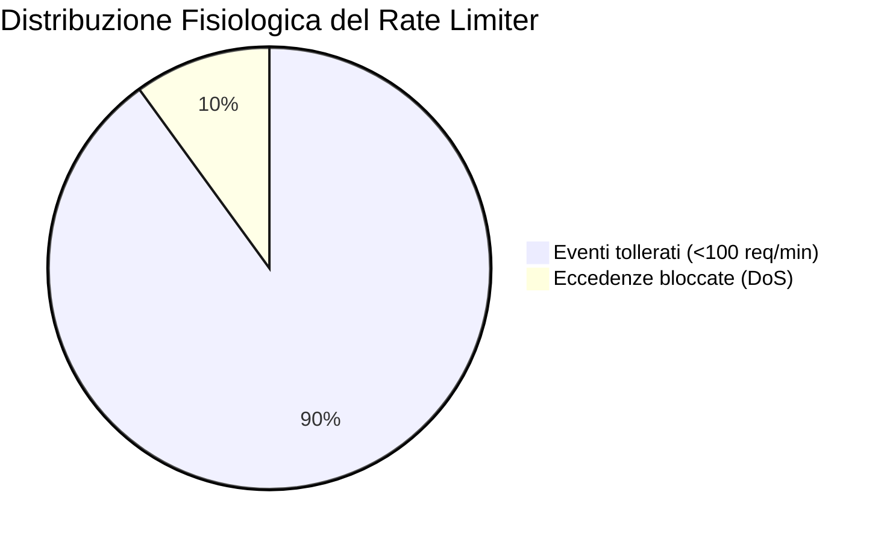

# Sentinel SIEM: Mappatura Slide vs Implementazione

Questo documento enciclopedico illustra in dettaglio come ogni concetto teorico presentato nelle lezioni del Prof. Tramontana (file in `Slides/`) sia stato tradotto in **codice industriale**, analizzandone non solo la posizione esatta ("il Dove") ma soprattutto il **trade-off architetturale** ("il Perché"). 

---

## 1. Sicurezza e Controllo degli Accessi

### `L5_Auth-hash` & `L5_Token` (Authenticator & Hashing)
**Teoria:** Non memorizzare mai password in chiaro; utilizzare algoritmi "memory-hard" come Scrypt per resistere agli attacchi a dizionario. Emettere Token Stateless per scalabilità orizzontale.
**Trade-off in Sentinel:** Invece del vecchio strato Session/Cookie (problematico su server distribuiti e microservizi SPA), l'autenticazione è stata delegata a un Token JWT firmato crittograficamente con `HMAC-SHA256`. Per l'hashing su database, è stato adottato l'algoritmo **Scrypt** raccomandato a lezione, in quanto la protezione contro l'accelerazione hardware (Rainbow Table / GPU) su un sistema cyber-security come Sentinel è categorica.

**Snippet dal `DataSeeder.java` e `JwtTokenProvider.java`:**
```java
// Hash passwords using Scrypt (L5_Auth-hash slide 11)
// SCryptUtil.scrypt(passwd, N=32768, r=8, p=1)
String adminHash = SCryptUtil.scrypt("admin", 32768, 8, 1);
```

### `L3_RoleBasedAC` (Role-Based Access Control)
**Teoria:** Gli accessi limitati si basano sul ruolo che l'utenza assume nel sistema. 
**Snippet dal Codice:** Spring Security si aggancia al ruolo `ADMIN` iniettato all'interno del token JWT.
```java
@PreAuthorize("hasRole('ADMIN')")
@GetMapping("/api/dashboard/adminOnly")
public String getSecretData() { ... }
```

### `L2_ReferenceMonitor` & `L13_RequestPipeline` (Reference Monitor)
**Teoria:** Ogni singola richiesta deve passare attraverso un varco obbligato per un'ispezione di sicurezza (Pipeline/Filtro), rigettando le richieste infette prima che raggiungano la logica di business.
**Implementazione in Sentinel:** Viene sfruttato il `OncePerRequestFilter` nativo di Spring Boot nel modulo `sentinel-api`. Funge da **Reference Monitor** non by-passabile che intercetta l'Header HTTP `Authorization: Bearer <token>`, ne convalida la firma crittografica e blocca a livello di rete ogni chiamata abusiva con un rigido `401 Unauthorized`.

---

## 2. Ingestion e Tolleranza Ingegneristica

### `L16_Messaging` (Asynchronous Messaging)

```mermaid
graph LR
    subgraph Publisher
      A[Sentinel Agent]
    end
    subgraph Message Broker
      MQ[(RabbitMQ Exchange)]
    end
    subgraph Subscriber
      C[Sentinel Core Consumer]
    end
    
    A -->|Push Event (AMQP)| MQ
    MQ -->|Pull costante| C
```
**Teoria:** Disaccoppiare la sorgente dei messaggi dal recettore per assorbire picchi anomali generati dalla rete.
**Trade-off in Sentinel:** Se l'Agent inviasse log in tempo reale tramite banali chiamate `REST POST` verso il Core (Accoppiamento Forte Sincrono), un attacco *Denial of Service* farebbe cadere sia la porta HTTP che il Database. Attraverso **RabbitMQ**, il cluster assorbe il colpo in RAM (Leaky Bucket) e il `sentinel-core` processerà gli avvisi solo alla velocità e capacità massima che i suoi Thread possono sopportare.
**Snippet in `EventConsumerService.java`:** Esempio del paradigma "Event-Driven Consumer".
```java
@RabbitListener(queues = "${sentinel.queue.ingress}")
public void processMessage(EventDTO event) {
    // Risveglio asincrono allo scatenarsi dell'evento
}
```

### `L11_IdempotentReceiver` (Idempotent Receiver)
**Teoria:** I broker di messaggistica garantiscono per natura *At-Least-Once Delivery*. Un riavvio di rete comporterebbe messaggi fantasma duplicati, avvelenando i grafici del SIEM con finti report raddoppiati.
**Trade-off in Sentinel:** Il sistema ignora l'ID dell'Agent ma computa proattivamente una funzione Hash (SHA-256) per sigillare deterministicamente gli attributi del log IP/Tempo. La delega di questo Pattern al Database (`UNIQUE CONSTRAINT`) protegge l'aggregazione matematica senza inquinare il server Java di stati distribuiti inconsistenti.
**Snippet in `HashUtils.java` e check atomico:**
```java
String hash = HashUtils.calculateEventHash(event); // SHA-256
if (rawEventRepository.existsByEventHash(hash)) {
    log.warn("Duplicato intercettato e scartato silente per Idempotenza.");
    return; 
}
```

### `L11_JavaCompletable` (Asynchronous Execution Threading)
**Teoria:** Non sprecare cicli di Clock tenendo in stallo thread vitali durante esecuzioni CPU-intensive o blocchi IO lunghi.
**Trade-off in Sentinel:** Mentre il RabbitListener scrive il log nativo sul database (veloce), l'attivazione dell'`AnalyticsEngine` per calcolare attacchi complessi (lento) è delegata a un **Thread Pool parallelo**. Questo schema *Leader-Follower* permette al Listener (Leader) di tornare istantaneamente a leggere le code RabbmitMQ, massimizzando il throughput globale d'immissione della rete.
**Snippet in `EventConsumerService.java`:**
```java
// Il thread AMQP passa oltre istantaneamente senza attendere L'Analytics
CompletableFuture.runAsync(() -> {
    analyticsService.analyzeEvent(event);
});
```

---

## 3. Resilienza e Limiti Strutturali (Resilience4J) 

### `L15_DPresilience` & `L17_Resilience4J` (Rate Limiter)


**Teoria:** L'infrastruttura difensiva deve riconoscere anomalie nel pattern frequenziale e spezzare/negare il surplus limitando dinamicamente il danno per IP. (Sliding Window Algorithm).
**Trade-off in Sentinel:** Era possibile implementarlo in RAM pura con `HashMap<String, Integer>`, costringendosi però a gestire la putrescenza delle finestre di tempo e le estrazioni lock-safe dei thread. L'implementazione sfrutta invece a fondo la libreria raccomandata `Resilience4j`, che offre un semaforo matematicamente provato.
**Snippet in `AnalyticsService.java`:**
```java
RateLimiter dosLimiter = rateLimiterRegistry.rateLimiter("dos-" + sourceIp, "dos");
if (!dosLimiter.acquirePermission()) {
    createAlert("DOS_ATTACK", "Volume exceeded 100 requests per minute limit");
}
```

### `L16_CircuitBreaker` (Circuit Breaker)
**Teoria:** Un servizio interrotto (o un DataBase in Timeout) deve essere evitato fallendo velocemente senza monopolizzare tutti i timeout di connessione dell'app.
**Implementazione in Sentinel:** Posto sulle rotte di esportazione dei report aggregati (processi esosi). Se il layer `Storage` soffre, restituisce Subito Report Vuoti/Pieni invece di propagare un disservizio 500 al client.
```java
@CircuitBreaker(name = "reportsService", fallbackMethod = "emptyReportFallback")
public DailyReport getHugeReportFromDB() { ... }
```

---

## 4. Astrazioni Architetturali e Presentazione

### `L5_RemoteFacadeDTO` (Remote Facade & DTO)
**Teoria:** Il network remoto è esponenzialmente più lento del network locale server-side. Spostare i dati a blocchi enormi incapsulati in `DTO` riduce il Chatty Traffic e l'Overhead Protocollo.
**Implementazione in Sentinel:** Nel front-end React, ricaricare il cruscotto avrebbe richiesto: (1) Call per lo status DB, (2) Call per lo status MQ, (3) Call per allarmi recenti, (4) Call per il traffico orario totale.
La *Remote Facade* unifica le logiche lato server fornendo un oggetto compositivo massiccio scambiato tramite una singola chiamata REST.
**Snippet in `DashboardController.java`:**
```java
@GetMapping("/summary")
public DashboardSummaryDTO getFullStatus() {
    return new DashboardSummaryDTO(
        healthService.getDbStatus(),
        healthService.getMqStatus(),
        alertService.getRecentAlerts(),
        eventService.getMetrics()
    );
}
```

### `L11_RequestBatch` (Request Batch)
**Teoria:** Ottimizza indagini multiple accorpando singole richieste separate per tagliare il tempo speso per lo scuotimento di mano a livello protocollo ed espandere parallelismo DB e CPU cache hit rates.
**Implementazione in Sentinel:** Quando un analista isola 50 macchine sospette nel SIEM sul frontend, non scatena un `foreach(...)` inviando 50 POST separate. Ne trasmette 1 massiva inglobata (`[ "10.0.0.1", "10.0.0.2" ]`). La logica di *Data Access* esegue una sola query SQL (`WHERE ip IN (...)`), risolvendo il vizio micidiale delle N+1 Queries.

### `L6_SessionStateSLOB` (Session State & Serialized LOB)
**Teoria:** Lo strato documentale è spesso un'estensione scomoda dei database relazionali per via dell'entropia delle configurazioni, evitate creando strutture super-normalizzate inutili (Joined EAV), preferite Serializzazioni Binary Json.
**Implementazione in Sentinel:** I Layout del cruscotto dell'investigatore (Session State - bozze incomplete) e la stampa immutabile mensile (DailyReport - storico compresso) ignorano la rigidità Relazionale. L'applicazione invia un intero albero JSON alla colonna `JSONB` di PostgreSQL, sfruttando performance analoghe a MongoDB ma mantenendo le transazioni ACID inossidabili.
