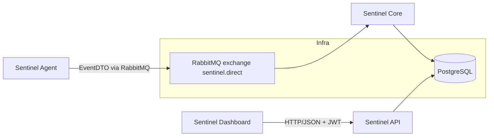
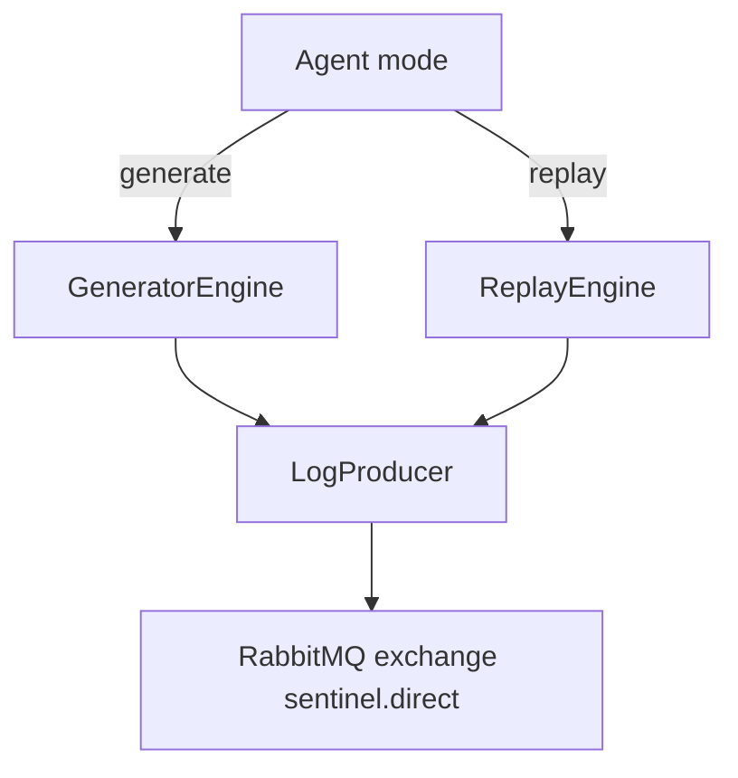
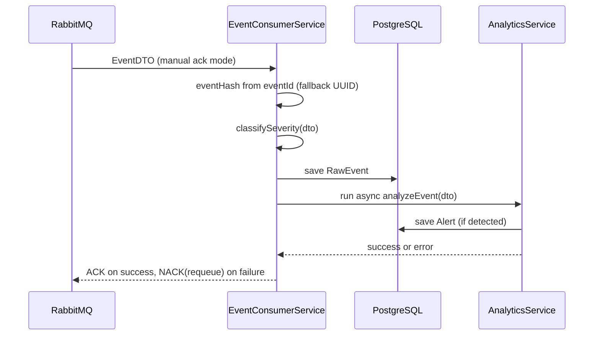
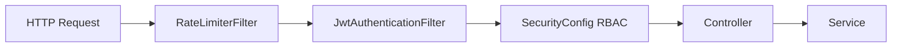
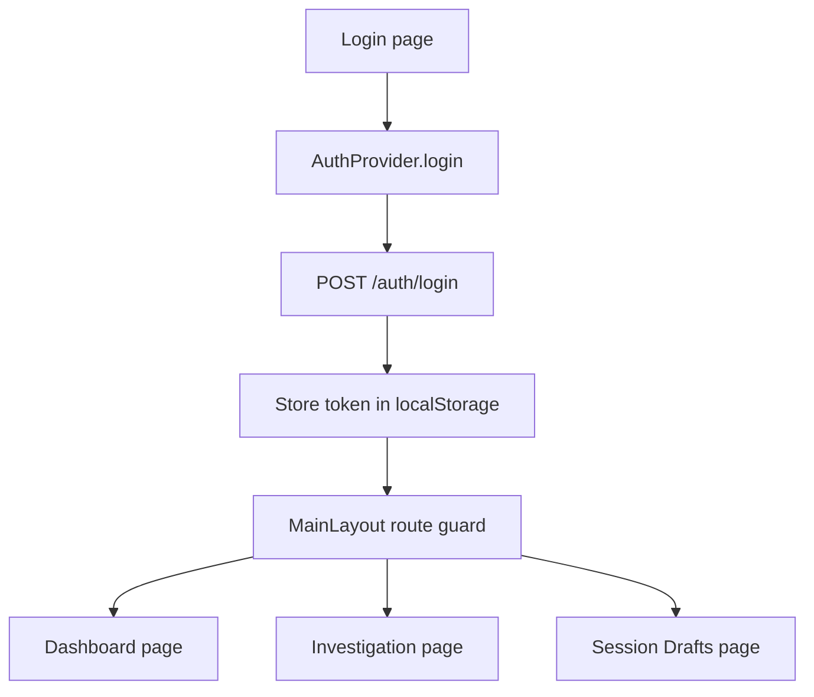

# Sentinel System Deep Dive (IT + EN)

## 1. Purpose and Reading Strategy / Obiettivo e strategia di lettura

### IT
Questo documento spiega in modo gerarchico e granulare come funziona Sentinel, dalla vista macro fino alle singole logiche runtime.

Ordine consigliato di lettura:
1. Visione generale e motivazioni architetturali.
2. Approfondimento modulo per modulo.
3. Flussi end-to-end (ingestion, auth, investigation, report).
4. Configurazione, failure mode, e impatti di modifica.

### EN
This document explains Sentinel in a hierarchical and granular way, from the macro architecture down to concrete runtime logic.

Recommended reading order:
1. Big picture and architectural motivations.
2. Module-by-module deep dive.
3. End-to-end flows (ingestion, auth, investigation, report).
4. Configuration, failure modes, and change impact.

## 2. L0 - System Overview / Vista generale del sistema

### 2.1 Topology / Topologia

### 2.2 Runtime ports / Porte runtime

| Component | Default port | Source |
|---|---:|---|
| sentinel-dashboard | 80 | [docker-compose.yml](../docker-compose.yml) |
| sentinel-api | 8083 | [docker-compose.yml](../docker-compose.yml), [sentinel-api/src/main/resources/application.properties](../sentinel-api/src/main/resources/application.properties) |
| sentinel-core | 8082 | [sentinel-core/src/main/resources/application.properties](../sentinel-core/src/main/resources/application.properties) |
| sentinel-agent | 8081 | [sentinel-agent/src/main/resources/application.properties](../sentinel-agent/src/main/resources/application.properties) |
| PostgreSQL | 5432 | [docker-compose.yml](../docker-compose.yml) |
| RabbitMQ AMQP | 5672 | [docker-compose.yml](../docker-compose.yml) |
| RabbitMQ Management | 15672 | [docker-compose.yml](../docker-compose.yml) |

### 2.3 Why this architecture / Perche questa architettura

### IT
Motivazioni principali:
1. Disaccoppiare producer e consumer con messaging asincrono.
2. Separare pipeline di ingestione, analytics, API e UI.
3. Rendere estendibili detection rules e contratti DTO senza bloccare l intero sistema.
4. Bilanciare chiarezza didattica e robustezza operativa.

### EN
Key motivations:
1. Decouple producers and consumers via asynchronous messaging.
2. Isolate ingestion, analytics, API, and UI concerns.
3. Keep detection rules and DTO contracts evolvable.
4. Balance academic clarity with operational robustness.

## 3. L1 - Shared Contracts: sentinel-common

### 3.1 What it contains / Cosa contiene

### IT
`sentinel-common` ospita i contratti condivisi fra moduli backend:
1. DTO di scambio (`EventDTO`, `DashboardSummaryDTO`).
2. Entita JPA (`RawEvent`, `Alert`, `User`, `DraftState`, `DailyReport`).
3. Configurazione RabbitMQ condivisa (`exchange`, `queue`, `binding`, converter JSON).

### EN
`sentinel-common` contains cross-module contracts:
1. Exchange DTOs (`EventDTO`, `DashboardSummaryDTO`).
2. Shared JPA entities (`RawEvent`, `Alert`, `User`, `DraftState`, `DailyReport`).
3. Shared RabbitMQ config (`exchange`, `queue`, `binding`, JSON converter).

### 3.2 Why it matters / Perche e importante

### IT
Riduce duplicazioni tra agent, core e api; evita divergenze di schema.

### EN
It prevents schema drift and duplicate model definitions across modules.

### 3.3 Key files / File chiave

1. [sentinel-common/src/main/java/com/sentinel/common/domain/dto/EventDTO.java](../sentinel-common/src/main/java/com/sentinel/common/domain/dto/EventDTO.java)
2. [sentinel-common/src/main/java/com/sentinel/common/domain/dto/DashboardSummaryDTO.java](../sentinel-common/src/main/java/com/sentinel/common/domain/dto/DashboardSummaryDTO.java)
3. [sentinel-common/src/main/java/com/sentinel/common/domain/entity/RawEvent.java](../sentinel-common/src/main/java/com/sentinel/common/domain/entity/RawEvent.java)
4. [sentinel-common/src/main/java/com/sentinel/common/domain/entity/Alert.java](../sentinel-common/src/main/java/com/sentinel/common/domain/entity/Alert.java)
5. [sentinel-common/src/main/java/com/sentinel/common/config/RabbitMQConfig.java](../sentinel-common/src/main/java/com/sentinel/common/config/RabbitMQConfig.java)

## 4. L1 - Producer Side: sentinel-agent

### 4.1 Responsibilities / Responsabilita

### IT
1. Generare eventi sintetici (`generate`) o replay storici (`replay`).
2. Costruire `EventDTO` con `eventId` UUID.
3. Pubblicare su RabbitMQ usando exchange condiviso e routing key configurabile.

### EN
1. Produce synthetic (`generate`) or replayed (`replay`) events.
2. Build `EventDTO` with UUID `eventId`.
3. Publish events to RabbitMQ via shared exchange and configured routing key.

### 4.2 Internal flow / Flusso interno

### 4.3 Core logic notes / Note logiche principali

### IT
1. `GeneratorEngine` usa `LogGenerator` per traffico realistico e scenari attacco.
2. `ReplayEngine` rilegge log storici e applica speedup temporale.
3. In entrambi i casi il producer invia `EventDTO` su `logs.ingress.key`.

### EN
1. `GeneratorEngine` uses `LogGenerator` for realistic traffic and attack scenarios.
2. `ReplayEngine` replays historical logs with configurable time speedup.
3. Both flows publish `EventDTO` to `logs.ingress.key`.

### 4.4 Key files / File chiave

1. [sentinel-agent/src/main/java/com/sentinel/agent/engine/GeneratorEngine.java](../sentinel-agent/src/main/java/com/sentinel/agent/engine/GeneratorEngine.java)
2. [sentinel-agent/src/main/java/com/sentinel/agent/engine/ReplayEngine.java](../sentinel-agent/src/main/java/com/sentinel/agent/engine/ReplayEngine.java)
3. [sentinel-agent/src/main/java/com/sentinel/agent/generator/ApacheAccessLogGenerator.java](../sentinel-agent/src/main/java/com/sentinel/agent/generator/ApacheAccessLogGenerator.java)
4. [sentinel-agent/src/main/java/com/sentinel/agent/producer/LogProducer.java](../sentinel-agent/src/main/java/com/sentinel/agent/producer/LogProducer.java)
5. [sentinel-agent/src/main/resources/application.properties](../sentinel-agent/src/main/resources/application.properties)

## 5. L1 - Processing Side: sentinel-core

### 5.1 Responsibilities / Responsabilita

### IT
1. Consumare eventi dalla queue ingress.
2. Applicare idempotenza e classificazione severita.
3. Persistenza `RawEvent` e analytics asincrona.
4. Generare `Alert` per DoS, Brute Force, Pattern Match.

### EN
1. Consume events from ingress queue.
2. Enforce idempotency and severity classification.
3. Persist `RawEvent` and run asynchronous analytics.
4. Generate `Alert` entries for DoS, Brute Force, Pattern Match.

### 5.2 Ingestion logic / Logica ingestione

### 5.3 Detection logic / Logica detection

### IT
1. DoS: limite per IP con rate limiter (100 eventi/min).
2. Brute Force: 401/403 oltre soglia (10 fail/min).
3. Pattern Match: endpoint malevolo su regex di severita critica.
4. Cooldown anti-spam per alert ripetuti sullo stesso IP.

### EN
1. DoS: per-IP rate limit (100 events/minute).
2. Brute Force: repeated 401/403 above threshold (10 failures/minute).
3. Pattern Match: critical malicious endpoint regex.
4. Cooldown window to avoid repeated alert spam for the same IP.

### 5.4 Why async analytics / Perche analytics asincrona

### IT
L analytics viene eseguita fuori dal thread principale di ingestione per evitare blocchi del listener e mantenere throughput accettabile.

### EN
Analytics runs asynchronously to keep the listener responsive and avoid ingestion bottlenecks.

### 5.5 Key files / File chiave

1. [sentinel-core/src/main/java/com/sentinel/core/service/EventConsumerService.java](../sentinel-core/src/main/java/com/sentinel/core/service/EventConsumerService.java)
2. [sentinel-core/src/main/java/com/sentinel/core/service/AnalyticsService.java](../sentinel-core/src/main/java/com/sentinel/core/service/AnalyticsService.java)
3. [sentinel-core/src/main/java/com/sentinel/core/config/AsyncConfig.java](../sentinel-core/src/main/java/com/sentinel/core/config/AsyncConfig.java)
4. [sentinel-core/src/main/resources/application.properties](../sentinel-core/src/main/resources/application.properties)

## 6. L1 - Exposure Side: sentinel-api

### 6.1 Responsibilities / Responsabilita

### IT
1. Autenticazione utente e emissione JWT.
2. Enforcement sicurezza (rate limiting, JWT filter, RBAC).
3. Esposizione endpoint dashboard, investigation, draft, report.
4. Aggregazione dati con facade coarse-grained.

### EN
1. User authentication and JWT issuance.
2. Security enforcement (rate limiting, JWT filter, RBAC).
3. Expose dashboard, investigation, draft, and report endpoints.
4. Aggregate data through coarse-grained service facades.

### 6.2 Security pipeline / Pipeline sicurezza

### 6.3 Endpoint map / Mappa endpoint

| Endpoint | Method | Role | Purpose |
|---|---|---|---|
| `/auth/login` | POST | Public | Login and JWT issuance |
| `/api/dashboard/summary` | GET | Authenticated | Coarse KPI summary |
| `/api/investigation/batch` | POST | Authenticated | Multi-IP alert investigation |
| `/api/draft` | GET/POST | Authenticated | Save/load investigation drafts |
| `/api/reports/daily` | GET | ADMIN | Daily report retrieval |

### 6.4 Service-level patterns / Pattern a livello service

### IT
1. `DashboardService`: Remote Facade per minimizzare round trip frontend.
2. `InvestigationService`: batch query su lista IP con query unica.
3. `SessionStateService`: persistenza stato bozza lato server.
4. `ReportService`: circuit breaker + serialized report JSON.

### EN
1. `DashboardService`: Remote Facade to reduce frontend round trips.
2. `InvestigationService`: batch query over multiple IPs.
3. `SessionStateService`: server-side draft state persistence.
4. `ReportService`: circuit breaker and serialized JSON reports.

### 6.5 Key files / File chiave

1. [sentinel-api/src/main/java/com/sentinel/api/security/SecurityConfig.java](../sentinel-api/src/main/java/com/sentinel/api/security/SecurityConfig.java)
2. [sentinel-api/src/main/java/com/sentinel/api/security/JwtAuthenticationFilter.java](../sentinel-api/src/main/java/com/sentinel/api/security/JwtAuthenticationFilter.java)
3. [sentinel-api/src/main/java/com/sentinel/api/security/RateLimiterFilter.java](../sentinel-api/src/main/java/com/sentinel/api/security/RateLimiterFilter.java)
4. [sentinel-api/src/main/java/com/sentinel/api/controller/AuthController.java](../sentinel-api/src/main/java/com/sentinel/api/controller/AuthController.java)
5. [sentinel-api/src/main/java/com/sentinel/api/controller/DashboardController.java](../sentinel-api/src/main/java/com/sentinel/api/controller/DashboardController.java)
6. [sentinel-api/src/main/java/com/sentinel/api/controller/InvestigationController.java](../sentinel-api/src/main/java/com/sentinel/api/controller/InvestigationController.java)
7. [sentinel-api/src/main/java/com/sentinel/api/controller/DraftController.java](../sentinel-api/src/main/java/com/sentinel/api/controller/DraftController.java)
8. [sentinel-api/src/main/java/com/sentinel/api/controller/ReportController.java](../sentinel-api/src/main/java/com/sentinel/api/controller/ReportController.java)
9. [sentinel-api/src/main/resources/application.properties](../sentinel-api/src/main/resources/application.properties)

## 7. L1 - UX Side: sentinel-dashboard

### 7.1 Responsibilities / Responsabilita

### IT
1. Login utente e gestione token JWT.
2. Navigazione pagine protette tramite layout con route guard.
3. Chiamate API centralizzate con interceptor Bearer.
4. Visualizzazione dashboard, investigation e session drafts.

### EN
1. User login and JWT token management.
2. Protected routes through guarded layout.
3. Centralized API calls with Bearer interceptor.
4. UI pages for dashboard, investigation, and drafts.

### 7.2 Frontend flow / Flusso frontend

### 7.3 Key files / File chiave

1. [sentinel-dashboard/src/App.tsx](../sentinel-dashboard/src/App.tsx)
2. [sentinel-dashboard/src/context/AuthProvider.tsx](../sentinel-dashboard/src/context/AuthProvider.tsx)
3. [sentinel-dashboard/src/components/MainLayout.tsx](../sentinel-dashboard/src/components/MainLayout.tsx)
4. [sentinel-dashboard/src/services/api.ts](../sentinel-dashboard/src/services/api.ts)
5. [sentinel-dashboard/src/pages/Dashboard.tsx](../sentinel-dashboard/src/pages/Dashboard.tsx)
6. [sentinel-dashboard/src/pages/Investigation.tsx](../sentinel-dashboard/src/pages/Investigation.tsx)
7. [sentinel-dashboard/src/pages/SessionDrafts.tsx](../sentinel-dashboard/src/pages/SessionDrafts.tsx)

## 8. L2 - End-to-End Scenarios / Scenari end-to-end

### 8.1 Event ingestion scenario / Scenario ingestione evento

### IT
1. Agent produce un `EventDTO` con `eventId` UUID.
2. Producer invia evento su RabbitMQ.
3. Core consuma, deduplica e salva `RawEvent`.
4. Core avvia analytics asincrona.
5. Se rilevata minaccia, salva `Alert`.
6. Al termine analytics, invia ACK; in errore, NACK + requeue.

### EN
1. Agent creates `EventDTO` with UUID `eventId`.
2. Producer publishes the event to RabbitMQ.
3. Core consumes, deduplicates, and stores `RawEvent`.
4. Core triggers asynchronous analytics.
5. If a threat is detected, it stores an `Alert`.
6. After analytics completion, ACK is sent; on failure, NACK + requeue.

### 8.2 Authentication scenario / Scenario autenticazione

### IT
1. Dashboard invia username/password a `/auth/login`.
2. API valida password con Scrypt contro hash DB.
3. API genera JWT con role claim.
4. Frontend salva token e lo invia come Bearer nelle richieste successive.
5. Jwt filter verifica token e SecurityConfig applica RBAC.

### EN
1. Dashboard posts username/password to `/auth/login`.
2. API validates password via Scrypt hash check.
3. API emits JWT including role claim.
4. Frontend stores token and sends Bearer auth on future requests.
5. JWT filter validates token and RBAC rules are enforced.

### 8.3 Investigation and reports scenario / Scenario investigation e report

### IT
1. Investigation invia lista IP in un solo batch.
2. API aggrega risultati da `AlertRepository.findBySourceIpIn`.
3. Session Drafts salva stato WIP per utente autenticato.
4. Report giornaliero passa da circuit breaker con fallback in degrado.

### EN
1. Investigation sends multiple IPs in one batch request.
2. API aggregates results through `AlertRepository.findBySourceIpIn`.
3. Session Drafts stores per-user WIP server-side state.
4. Daily report uses a circuit breaker with degraded fallback.

## 9. L3 - Data Model and Persistence / Modello dati e persistenza

### 9.1 Core entities / Entita principali

| Entity | Main fields | Notes |
|---|---|---|
| `RawEvent` | `eventHash`, `sourceIp`, `requestPath`, `statusCode`, `severity`, `ingestedAt` | `eventHash` unique for idempotency |
| `Alert` | `id`, `type`, `sourceIp`, `description`, `createdAt` | alert records for detections |
| `User` | `id`, `username`, `passwordHash`, `role` | auth and RBAC |
| `DraftState` | `id`, `userId`, `draftPayload`, `updatedAt` | server-side draft persistence |
| `DailyReport` | `id`, `reportDate`, `reportData` | serialized report snapshot |

### 9.2 Why this model / Perche questo modello

### IT
Il modello separa eventi grezzi, alert derivati, identita utente e stato applicativo per ridurre accoppiamento e semplificare query mirate.

### EN
The model separates raw events, derived alerts, user identity, and application state to reduce coupling and keep queries targeted.

## 10. L3 - Configuration and Deployment / Configurazione e deployment

### 10.1 Configuration sources / Fonti configurazione

1. [docker-compose.yml](../docker-compose.yml)
2. [sentinel-agent/src/main/resources/application.properties](../sentinel-agent/src/main/resources/application.properties)
3. [sentinel-core/src/main/resources/application.properties](../sentinel-core/src/main/resources/application.properties)
4. [sentinel-api/src/main/resources/application.properties](../sentinel-api/src/main/resources/application.properties)
5. [sentinel-dashboard/src/services/api.ts](../sentinel-dashboard/src/services/api.ts)
6. [.env.example](../.env.example)

### 10.2 Deployment modes / Modalita deployment

### IT
1. Full Docker: avvio stack completo con un solo comando.
2. Infra Docker + backend/frontend manuale: utile per sviluppo e debug.

### EN
1. Full Docker: one-command startup for the full stack.
2. Docker infra + manual backend/frontend: preferred for iterative development and debugging.

## 11. L3 - Reliability and Failure Behavior / Affidabilita e failure behavior

### 11.1 Key failure points / Punti critici

### IT
1. Broker indisponibile: il producer non recapita e il core non consuma.
2. DB indisponibile: salvataggio eventi/alert fallisce.
3. Errore analytics: NACK con requeue per evitare perdita evento.
4. Rate limit API superato: risposta 429 prima della business logic.

### EN
1. Broker unavailable: producer cannot publish and core cannot consume.
2. DB unavailable: event/alert persistence fails.
3. Analytics exception: NACK with requeue to prevent event loss.
4. API rate limit exceeded: 429 before business logic execution.

### 11.2 Reliability choices / Scelte di affidabilita

### IT
1. Manual ACK post-analytics per ridurre perdita dati.
2. Circuit breaker sui report per evitare cascading failures.
3. Cooldown alert per limitare rumore operativo.

### EN
1. Manual ACK after analytics to reduce data-loss risk.
2. Circuit breaker on reporting to avoid cascading failures.
3. Alert cooldown to reduce operational noise.

## 12. Change Impact Guide / Guida impatto modifiche

### 12.1 If you change the DTO / Se modifichi i DTO

1. Update shared contracts in `sentinel-common` first.
2. Re-check producer mapping in agent and consumer mapping in core.
3. Re-check API response contracts and frontend types.

### 12.2 If you change security / Se modifichi sicurezza

1. Validate `RateLimiterFilter`, `JwtAuthenticationFilter`, `SecurityConfig` coherence.
2. Re-test login, protected endpoints, and role restrictions.
3. Review CORS and token configuration in both API and dashboard.

### 12.3 If you change ingestion or analytics / Se modifichi ingestion o analytics

1. Re-test ACK/NACK semantics and requeue behavior.
2. Re-test thresholds and alert generation consistency.
3. Re-check dashboard metrics and investigation output.

## 13. Related Documents / Documenti collegati

1. [README.md](../README.md) - operational entry point.
2. [Software Architecture Document.md](../Software%20Architecture%20Document.md) - architecture rationale.
3. [Software Design Document.md](../Software%20Design%20Document.md) - design and schema details.
4. [Technical Design Document.md](../Technical%20Design%20Document.md) - technical decisions and configuration.
5. [docs/uml/Component_UML.md](./uml/Component_UML.md)
6. [docs/uml/Sequence_UML.md](./uml/Sequence_UML.md)
7. [docs/uml/Deployment_UML.md](./uml/Deployment_UML.md)
8. [docs/uml/Class_UML.md](./uml/Class_UML.md)

## 14. Quick Summary / Sintesi rapida

### IT
Sentinel e una pipeline event-driven: Agent produce eventi, Core li valida e analizza, API espone funzionalita protette, Dashboard fornisce interazione utente. La robustezza dipende da idempotenza, ACK/NACK manuale, rate limiting, e configurazioni sicure.

### EN
Sentinel is an event-driven pipeline: Agent produces events, Core validates and analyzes them, API exposes protected capabilities, and Dashboard provides user interaction. Robustness relies on idempotency, manual ACK/NACK, rate limiting, and secure configuration.