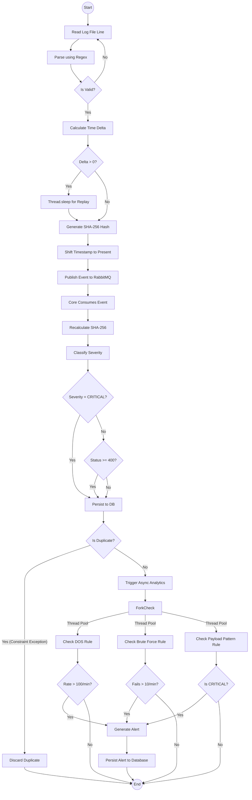

# Sentinel SIEM - Activity Diagram

This diagram details the step-by-step logic and decision forks that occur when a log is read by the Agent and processed by the Core.

```mermaid
flowchart TD
    %% Agent Activity
    Start((Start)) --> ReadLog[Read Log File Line]
    ReadLog --> ParseRegEx[Parse using Regex]
    ParseRegEx --> IsValid{Is Valid?}
    
    IsValid -- No --> ReadLog
    IsValid -- Yes --> CalcDelta[Calculate Time Delta]
    
    CalcDelta --> CheckTime{Delta > 0?}
    CheckTime -- Yes --> SleepWait[Thread.sleep for Replay]
    CheckTime -- No --> HashGen
    SleepWait --> HashGen[Generate SHA-256 Hash]
    
    HashGen --> ShiftTime[Shift Timestamp to Present]
    ShiftTime --> PubRabbit[Publish Event to RabbitMQ]
    
    %% Core Activity
    PubRabbit --> ConsumeEvent[Core Consumes Event]
    ConsumeEvent --> Rehash[Recalculate SHA-256]
    Rehash --> Classify[Classify Severity]
    
    Classify --> IsCritical{Severity = CRITICAL?}
    IsCritical -- Yes --> DBWrite[Persist to DB]
    IsCritical -- No --> CheckWarn{Status >= 400?}
    CheckWarn -- Yes --> DBWrite
    CheckWarn -- No --> DBWrite
    
    DBWrite --> UniqueCheck{Is Duplicate?}
    UniqueCheck -- Yes (Constraint Exception) --> Discard[Discard Duplicate] --> End((End))
    
    UniqueCheck -- No --> AsyncTrigger[Trigger Async Analytics]
    AsyncTrigger --> ForkCheck
    
    %% Parallel Threat Detection
    ForkCheck --> |Thread Pool| CheckDos[Check DOS Rule]
    ForkCheck --> |Thread Pool| CheckBF[Check Brute Force Rule]
    ForkCheck --> |Thread Pool| CheckPattern[Check Payload Pattern Rule]
    
    CheckDos --> DosLimit{Rate > 100/min?}
    CheckBF --> BFLimit{Fails > 10/min?}
    CheckPattern --> PatternHit{Is CRITICAL?}
    
    DosLimit -- Yes --> AlertCreate[Generate Alert]
    BFLimit -- Yes --> AlertCreate
    PatternHit -- Yes --> AlertCreate
    
    DosLimit -- No --> End
    BFLimit -- No --> End
    PatternHit -- No --> End
    
    AlertCreate --> AlertDBWrite[Persist Alert to Database]
    AlertDBWrite --> End
```
