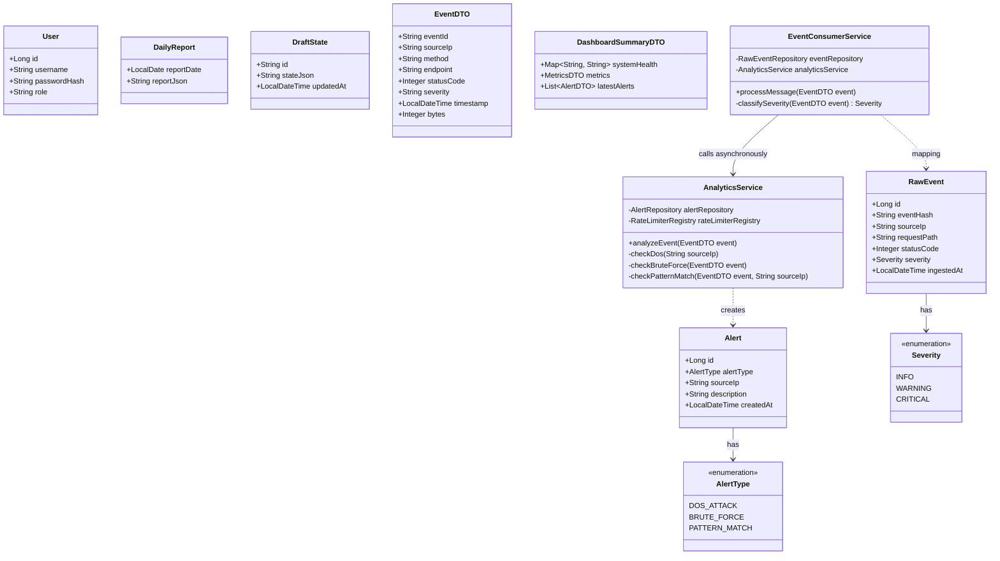

# Sentinel SIEM - Class Diagram

This diagram illustrates the core domain model, entities, enums, data transfer objects, and the primary services that handle them.

```mermaid
classDiagram
    %% Entities
    class RawEvent {
        +Long id
        +String eventHash
        +String sourceIp
        +String requestPath
        +Integer statusCode
        +Severity severity
        +LocalDateTime ingestedAt
    }
    
    class Alert {
        +Long id
        +AlertType alertType
        +String sourceIp
        +String description
        +LocalDateTime createdAt
    }
    
    class User {
        +Long id
        +String username
        +String passwordHash
        +String role
    }
    
    class DailyReport {
        +LocalDate reportDate
        +String reportJson
    }

    class DraftState {
        +String id
        +String stateJson
        +LocalDateTime updatedAt
    }
    
    %% Enums
    class Severity {
        <<enumeration>>
        INFO
        WARNING
        CRITICAL
    }
    
    class AlertType {
        <<enumeration>>
        DOS_ATTACK
        BRUTE_FORCE
        PATTERN_MATCH
    }

    %% DTOs
    class EventDTO {
        +String eventId
        +String sourceIp
        +String method
        +String endpoint
        +Integer statusCode
        +String severity
        +LocalDateTime timestamp
        +Integer bytes
    }
    
    class DashboardSummaryDTO {
        +Map~String, String~ systemHealth
        +MetricsDTO metrics
        +List~AlertDTO~ latestAlerts
    }

    %% Relationships
    RawEvent --> Severity : has
    Alert --> AlertType : has
    
    %% Core Services
    class AnalyticsService {
        -AlertRepository alertRepository
        -RateLimiterRegistry rateLimiterRegistry
        +analyzeEvent(EventDTO event)
        -checkDos(String sourceIp)
        -checkBruteForce(EventDTO event)
        -checkPatternMatch(EventDTO event, String sourceIp)
    }
    
    class EventConsumerService {
        -RawEventRepository eventRepository
        -AnalyticsService analyticsService
        +processMessage(EventDTO event)
        -classifySeverity(EventDTO event) Severity
    }
    
    %% Dependencies
    EventConsumerService ..> RawEvent : mapping
    EventConsumerService --> AnalyticsService : calls asynchronously
    AnalyticsService ..> Alert : creates
```
