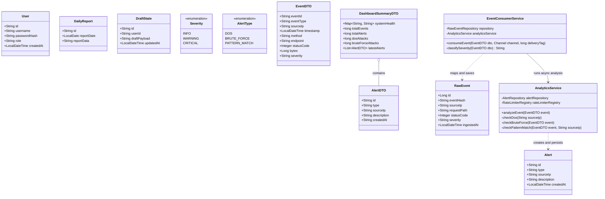

# Sentinel SIEM - Class Diagram

This diagram mirrors the as-built domain model, DTOs, and core services.

```mermaid
classDiagram
    %% Entities
    class RawEvent {
        +Long id
        +String eventHash
        +String sourceIp
        +String requestPath
        +Integer statusCode
        +String severity
        +LocalDateTime ingestedAt
    }

    class Alert {
        +String id
        +String type
        +String sourceIp
        +String description
        +LocalDateTime createdAt
    }

    class User {
        +String id
        +String username
        +String passwordHash
        +String role
        +LocalDateTime createdAt
    }

    class DailyReport {
        +String id
        +LocalDate reportDate
        +String reportData
    }

    class DraftState {
        +String id
        +String userId
        +String draftPayload
        +LocalDateTime updatedAt
    }

    %% Conceptual enums (defined in codebase, values used as strings in entities)
    class Severity {
        <<enumeration>>
        INFO
        WARNING
        CRITICAL
    }

    class AlertType {
        <<enumeration>>
        DOS
        BRUTE_FORCE
        PATTERN_MATCH
    }

    %% DTOs
    class EventDTO {
        +String eventId
        +String eventType
        +String sourceIp
        +LocalDateTime timestamp
        +String method
        +String endpoint
        +Integer statusCode
        +Long bytes
        +String severity
    }

    class DashboardSummaryDTO {
        +Map~String, String~ systemHealth
        +long totalEvents
        +long totalAlerts
        +long dosAttacks
        +long bruteForceAttacks
        +List~AlertDTO~ latestAlerts
    }

    class AlertDTO {
        +String id
        +String type
        +String sourceIp
        +String description
        +String createdAt
    }

    %% Core Services
    class AnalyticsService {
        -AlertRepository alertRepository
        -RateLimiterRegistry rateLimiterRegistry
        +analyzeEvent(EventDTO event)
        -checkDos(String sourceIp)
        -checkBruteForce(EventDTO event)
        -checkPatternMatch(EventDTO event, String sourceIp)
    }

    class EventConsumerService {
        -RawEventRepository repository
        -AnalyticsService analyticsService
        +consumeEvent(EventDTO dto, Channel channel, long deliveryTag)
        -classifySeverity(EventDTO dto) String
    }

    %% Relationships
    DashboardSummaryDTO o-- AlertDTO : contains
    EventConsumerService ..> RawEvent : maps and saves
    EventConsumerService --> AnalyticsService : runs async analysis
    AnalyticsService ..> Alert : creates and persists
```
