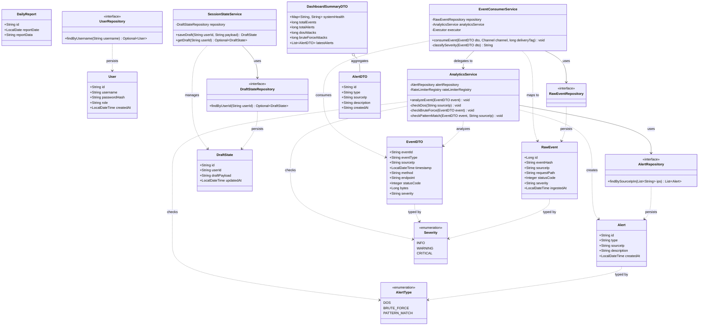

# Sentinel SIEM - Class Diagram

This diagram mirrors the as-built domain model, DTOs, repositories, and core services with standard UML stereotypes and relationships.

```mermaid
classDiagram
    %% Entities
    class RawEvent {
        +Long id
        +String eventHash
        +String sourceIp
        +String requestPath
        +Integer statusCode
        +String severity
        +LocalDateTime ingestedAt
    }

    class Alert {
        +String id
        +String type
        +String sourceIp
        +String description
        +LocalDateTime createdAt
    }

    class User {
        +String id
        +String username
        +String passwordHash
        +String role
        +LocalDateTime createdAt
    }

    class DailyReport {
        +String id
        +LocalDate reportDate
        +String reportData
    }

    class DraftState {
        +String id
        +String userId
        +String draftPayload
        +LocalDateTime updatedAt
    }

    %% Enumerations
    class Severity {
        <<enumeration>>
        INFO
        WARNING
        CRITICAL
    }

    class AlertType {
        <<enumeration>>
        DOS
        BRUTE_FORCE
        PATTERN_MATCH
    }

    %% Repositories (Interfaces)
    class RawEventRepository {
        <<interface>>
    }

    class AlertRepository {
        <<interface>>
        +findBySourceIpIn(List~String~ ips) List~Alert~
    }

    class UserRepository {
        <<interface>>
        +findByUsername(String username) Optional~User~
    }

    class DraftStateRepository {
        <<interface>>
        +findByUserId(String userId) Optional~DraftState~
    }

    %% Services
    class EventConsumerService {
        -RawEventRepository repository
        -AnalyticsService analyticsService
        -Executor executor
        +consumeEvent(EventDTO dto, Channel channel, long deliveryTag) void
        -classifySeverity(EventDTO dto) String
    }

    class AnalyticsService {
        -AlertRepository alertRepository
        -RateLimiterRegistry rateLimiterRegistry
        +analyzeEvent(EventDTO event) void
        -checkDos(String sourceIp) void
        -checkBruteForce(EventDTO event) void
        -checkPatternMatch(EventDTO event, String sourceIp) void
    }

    class SessionStateService {
        -DraftStateRepository repository
        +saveDraft(String userId, String payload) DraftState
        +getDraft(String userId) Optional~DraftState~
    }

    %% DTOs
    class EventDTO {
        +String eventId
        +String eventType
        +String sourceIp
        +LocalDateTime timestamp
        +String method
        +String endpoint
        +Integer statusCode
        +Long bytes
        +String severity
    }

    class DashboardSummaryDTO {
        +Map~String, String~ systemHealth
        +long totalEvents
        +long totalAlerts
        +long dosAttacks
        +long bruteForceAttacks
        +List~AlertDTO~ latestAlerts
    }

    class AlertDTO {
        +String id
        +String type
        +String sourceIp
        +String description
        +String createdAt
    }

    %% Relationships
    EventConsumerService --> RawEventRepository : uses
    EventConsumerService --> AnalyticsService : delegates to
    EventConsumerService ..> EventDTO : consumes
    EventConsumerService ..> RawEvent : maps to
    
    AnalyticsService --> AlertRepository : uses
    AnalyticsService ..> Alert : creates
    AnalyticsService ..> EventDTO : analyzes
    AnalyticsService ..> AlertType : checks
    AnalyticsService ..> Severity : checks

    SessionStateService --> DraftStateRepository : uses
    SessionStateService ..> DraftState : manages

    RawEventRepository ..> RawEvent : persists
    AlertRepository ..> Alert : persists
    DraftStateRepository ..> DraftState : persists
    UserRepository ..> User : persists

    DashboardSummaryDTO o-- AlertDTO : aggregates
    EventDTO ..> Severity : typed by
    RawEvent ..> Severity : typed by
    Alert ..> AlertType : typed by
```
