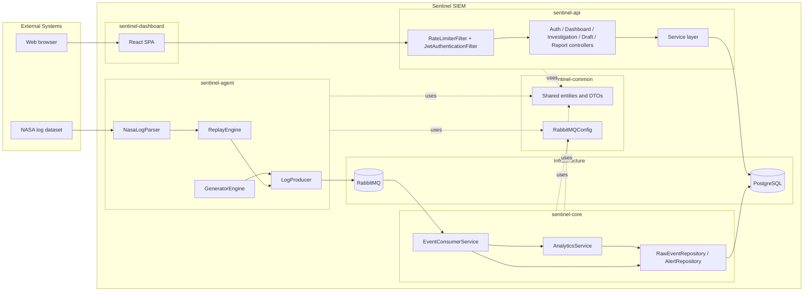

# Sentinel SIEM - Component Diagram

Shows the as-built module boundaries and runtime interactions.

```mermaid
flowchart LR
    subgraph EXT["External Systems"]
        Logs["NASA log dataset"]
        Browser["Web browser"]
    end

    subgraph SIEM["Sentinel SIEM"]
        subgraph DASH_MOD["sentinel-dashboard"]
            DashboardSPA["React SPA"]
        end

        subgraph AGENT_MOD["sentinel-agent"]
            ReplayEngine["ReplayEngine"]
            GeneratorEngine["GeneratorEngine"]
            Parser["NasaLogParser"]
            Producer["LogProducer"]
        end

        subgraph CORE_MOD["sentinel-core"]
            ConsumerSvc["EventConsumerService"]
            AnalyticsSvc["AnalyticsService"]
            CoreRepos["RawEventRepository / AlertRepository"]
        end

        subgraph API_MOD["sentinel-api"]
            SecurityFilters["RateLimiterFilter + JwtAuthenticationFilter"]
            Controllers["Auth / Dashboard / Investigation / Draft / Report controllers"]
            ApiServices["Service layer"]
        end

        subgraph COMMON_MOD["sentinel-common"]
            Contracts["Shared entities and DTOs"]
            RabbitCfg["RabbitMQConfig"]
        end

        subgraph INFRA["Infrastructure"]
            Broker[("RabbitMQ")]
            Database[("PostgreSQL")]
        end
    end

    %% Agent flow
    Logs --> Parser
    Parser --> ReplayEngine
    ReplayEngine --> Producer
    GeneratorEngine --> Producer
    Producer --> Broker

    %% Core flow
    Broker --> ConsumerSvc
    ConsumerSvc --> AnalyticsSvc
    ConsumerSvc --> CoreRepos
    AnalyticsSvc --> CoreRepos
    CoreRepos --> Database

    %% API flow
    Browser --> DashboardSPA
    DashboardSPA --> SecurityFilters
    SecurityFilters --> Controllers
    Controllers --> ApiServices
    ApiServices --> Database

    %% Shared module usage
    AGENT_MOD -. uses .-> Contracts
    CORE_MOD -. uses .-> Contracts
    API_MOD -. uses .-> Contracts
    AGENT_MOD -. uses .-> RabbitCfg
    CORE_MOD -. uses .-> RabbitCfg
```
