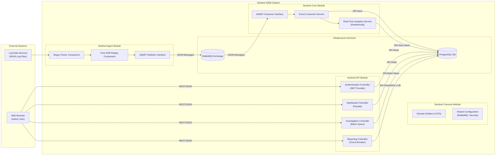

# Sentinel SIEM - Component Diagram

Shows the structural architectural building blocks of the SIEM platform and how they interface with each other.

```mermaid
flowchart LR
    subgraph EXT["External Systems"]
        Logs["Log Data Sources\n(NASA Log Files)"]
        Client["Web Browser\n(Admin User)"]
    end

    subgraph SIEM["Sentinel SIEM System"]
        
        subgraph AGENT_MOD["Sentinel Agent Module"]
            LogParser["Regex Parser Component"]
            ReplayEngine["Time-Shift Replay Component"]
            RabbitPublisher["AMQP Publisher Interface"]
        end
        
        subgraph CORE_MOD["Sentinel Core Module"]
            RabbitConsumer["AMQP Consumer Interface"]
            ConsumerSvc["Event Consumer Service"]
            AnalyticsSvc["Real-Time Analytics Service\n(Resilience4j)"]
        end
        
        subgraph API_MOD["Sentinel API Module"]
            AuthCtrl["Authentication Controller\n(JWT Provider)"]
            DashCtrl["Dashboard Controller\n(Facade)"]
            InvestCtrl["Investigation Controller\n(Batch Query)"]
            ReportCtrl["Reporting Controller\n(Circuit Breaker)"]
        end
        
        subgraph COMMON_MOD["Sentinel Common Module"]
            Entities["Domain Entities & DTOs"]
            Config["Shared Configuration\n(RabbitMQ, Security)"]
        end

        subgraph INFRA["Infrastructure Services"]
            Broker[("RabbitMQ Exchange")]
            Database[("PostgreSQL DB")]
        end
        
    end

    %% Internal wiring
    Logs --> LogParser
    LogParser --> ReplayEngine
    ReplayEngine --> RabbitPublisher
    
    RabbitPublisher -- "JSON Messages" --> Broker
    Broker -- "JSON Messages" --> RabbitConsumer
    
    RabbitConsumer --> ConsumerSvc
    ConsumerSvc --> AnalyticsSvc
    ConsumerSvc -- "JPA Save" --> Database
    AnalyticsSvc -- "JPA Save Alerts" --> Database
    
    AuthCtrl -- "JPA Read" --> Database
    DashCtrl -- "JPA Read" --> Database
    InvestCtrl -- "JPA Batch Read" --> Database
    ReportCtrl -- "JPA Read/Write LOB" --> Database
    
    Client -- "REST/JSON" --> AuthCtrl
    Client -- "REST/JSON" --> DashCtrl
    Client -- "REST/JSON" --> InvestCtrl
    Client -- "REST/JSON" --> ReportCtrl
```
