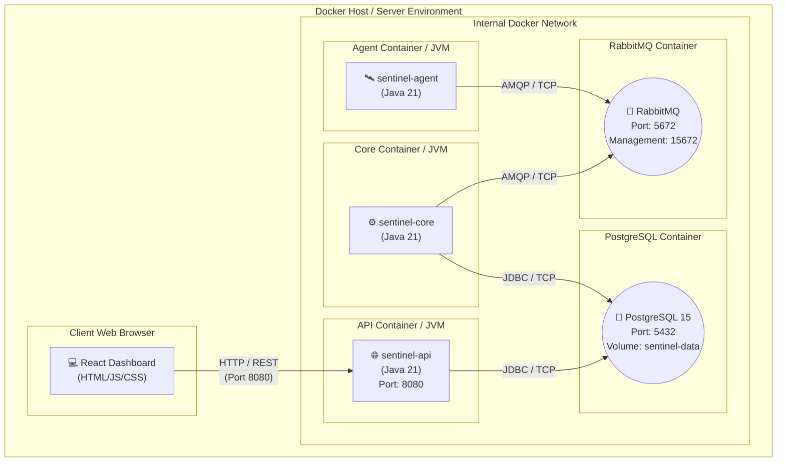

# Sentinel SIEM - Deployment Diagram

Shows the physical/logical network nodes where components and containers are deployed.

```mermaid
flowchart TB
    subgraph Host["Docker Host / Server Environment"]
        
        subgraph Network_Backend["Internal Docker Network"]
            
            subgraph Container_Broker["RabbitMQ Container"]
                RMQ(("🐰 RabbitMQ\nPort: 5672\nManagement: 15672"))
            end
            
            subgraph Container_DB["PostgreSQL Container"]
                PG(("🐘 PostgreSQL 15\nPort: 5432\nVolume: sentinel-data"))
            end
            
            subgraph JVM_Agent["Agent Container / JVM"]
                App_Agent["🛰️ sentinel-agent\n(Java 21)"]
            end
            
            subgraph JVM_Core["Core Container / JVM"]
                App_Core["⚙️ sentinel-core\n(Java 21)"]
            end
            
            subgraph JVM_API["API Container / JVM"]
                App_API["🌐 sentinel-api\n(Java 21)\nPort: 8080"]
            end
            
            %% Connections
            App_Agent -- "AMQP / TCP" --> RMQ
            App_Core -- "AMQP / TCP" --> RMQ
            App_Core -- "JDBC / TCP" --> PG
            App_API -- "JDBC / TCP" --> PG
            
        end
        
        subgraph Web_Client["Client Web Browser"]
            ReactUI["💻 React Dashboard\n(HTML/JS/CSS)"]
        end
        
        %% External Connection
        ReactUI -- "HTTP / REST\n(Port 8080)" --> App_API
    end
```
