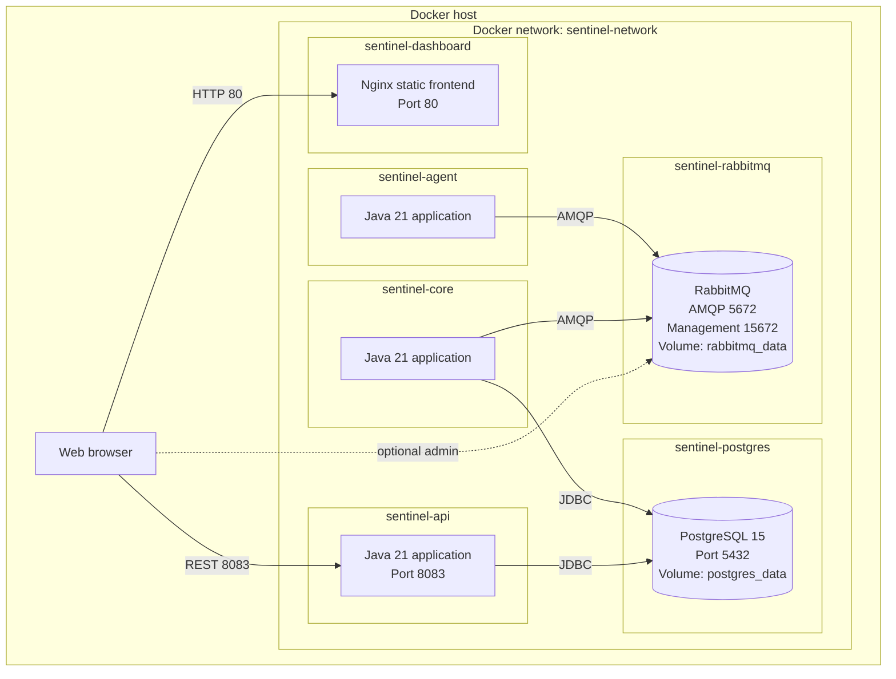

# Sentinel SIEM - Deployment Diagram

Shows the deployed container topology defined in docker-compose.

```mermaid
flowchart TB
    subgraph Host["Docker host"]
        subgraph Network["Docker network: sentinel-network"]
            subgraph PostgresContainer["sentinel-postgres"]
                PG[("PostgreSQL 15\nPort 5432\nVolume: postgres_data")]
            end

            subgraph RabbitContainer["sentinel-rabbitmq"]
                RMQ[("RabbitMQ\nAMQP 5672\nManagement 15672\nVolume: rabbitmq_data")]
            end

            subgraph AgentContainer["sentinel-agent"]
                AgentApp["Java 21 application"]
            end

            subgraph CoreContainer["sentinel-core"]
                CoreApp["Java 21 application"]
            end

            subgraph ApiContainer["sentinel-api"]
                ApiApp["Java 21 application\nPort 8083"]
            end

            subgraph DashboardContainer["sentinel-dashboard"]
                DashboardNginx["Nginx static frontend\nPort 80"]
            end
        end

        Browser["Web browser"]
    end

    %% Internal service communication
    AgentApp -- AMQP --> RMQ
    CoreApp -- AMQP --> RMQ
    CoreApp -- JDBC --> PG
    ApiApp -- JDBC --> PG

    %% External access paths
    Browser -- HTTP 80 --> DashboardNginx
    Browser -- REST 8083 --> ApiApp
    Browser -. optional admin .-> RMQ
```
