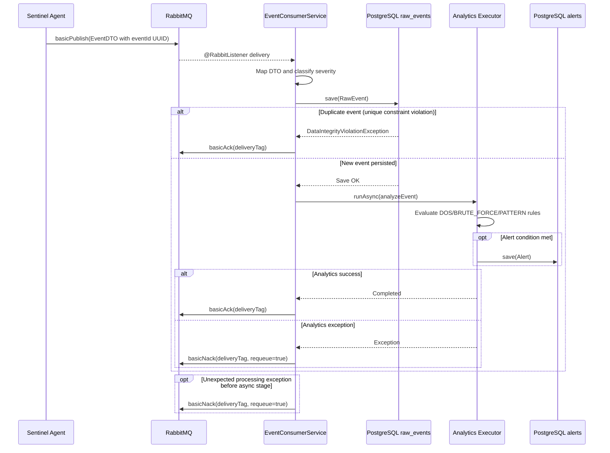
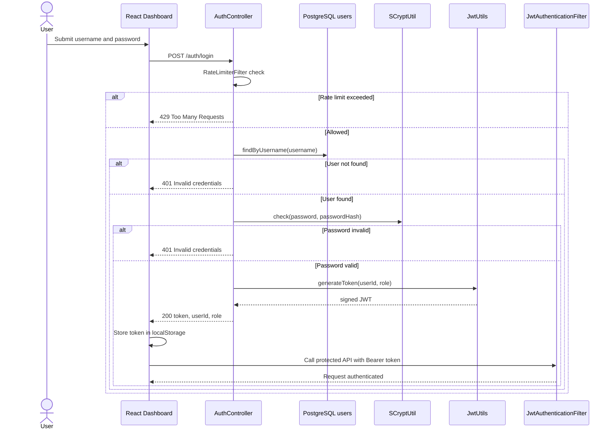

# Sentinel SIEM - Sequence Diagrams

Shows the chronological interaction between components.

## 1. Event Ingestion Sequence

```mermaid
sequenceDiagram
    participant Agent as Sentinel Agent
    participant RMQ as RabbitMQ
    participant Core as EventConsumerService
    participant RawDB as PostgreSQL raw_events
    participant Async as Analytics Executor
    participant AlertDB as PostgreSQL alerts

    Agent->>RMQ: basicPublish(EventDTO with eventId UUID)
    RMQ-->>Core: @RabbitListener delivery

    Core->>Core: Map DTO and classify severity
    Core->>RawDB: save(RawEvent)

    alt Duplicate event (unique constraint violation)
        RawDB-->>Core: DataIntegrityViolationException
        Core->>RMQ: basicAck(deliveryTag)
    else New event persisted
        RawDB-->>Core: Save OK
        Core->>Async: runAsync(analyzeEvent)

        Async->>Async: Evaluate DOS/BRUTE_FORCE/PATTERN rules
        opt Alert condition met
            Async->>AlertDB: save(Alert)
        end

        alt Analytics success
            Async-->>Core: Completed
            Core->>RMQ: basicAck(deliveryTag)
        else Analytics exception
            Async-->>Core: Exception
            Core->>RMQ: basicNack(deliveryTag, requeue=true)
        end
    end

    opt Unexpected processing exception before async stage
        Core->>RMQ: basicNack(deliveryTag, requeue=true)
    end
```

## 2. Authentication Sequence (Login)

```mermaid
sequenceDiagram
    actor User
    participant UI as React Dashboard
    participant API as AuthController
    participant UsersDB as PostgreSQL users
    participant Crypto as SCryptUtil
    participant JwtUtils as JwtUtils
    participant Security as JwtAuthenticationFilter

    User->>UI: Submit username and password
    UI->>API: POST /auth/login

    API->>API: RateLimiterFilter check
    alt Rate limit exceeded
        API-->>UI: 429 Too Many Requests
    else Allowed
        API->>UsersDB: findByUsername(username)

        alt User not found
            API-->>UI: 401 Invalid credentials
        else User found
            API->>Crypto: check(password, passwordHash)

            alt Password invalid
                API-->>UI: 401 Invalid credentials
            else Password valid
                API->>JwtUtils: generateToken(userId, role)
                JwtUtils-->>API: signed JWT
                API-->>UI: 200 token, userId, role

                UI->>UI: Store token in localStorage
                UI->>Security: Call protected API with Bearer token
                Security-->>UI: Request authenticated
            end
        end
    end
```
