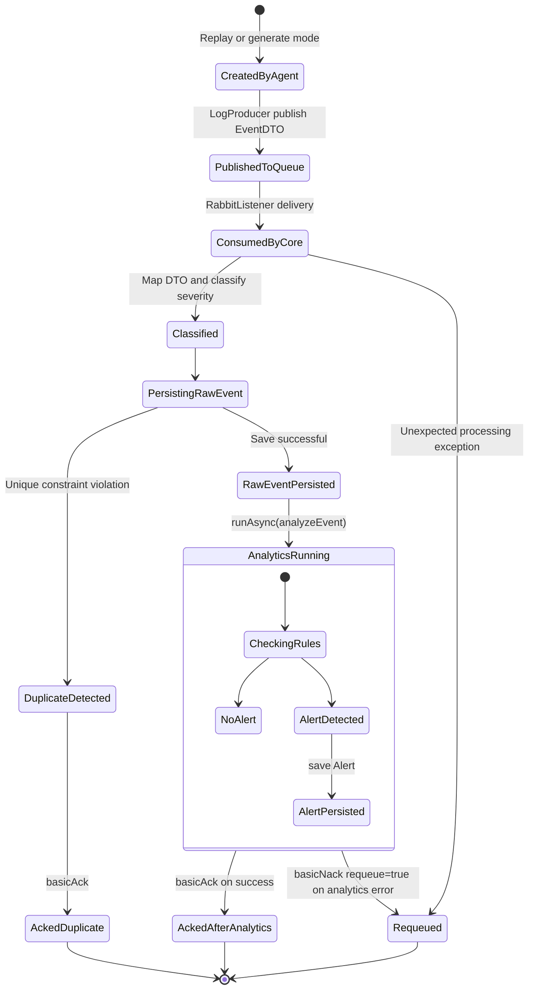

# Sentinel SIEM - State Machine Diagram

Illustrates the implemented lifecycle of an event from Agent publication
to Core persistence, analytics, and queue acknowledgement.

```mermaid
stateDiagram-v2
    [*] --> CreatedByAgent : Replay or generate mode
    CreatedByAgent --> PublishedToQueue : LogProducer publish EventDTO
    PublishedToQueue --> ConsumedByCore : RabbitListener delivery

    ConsumedByCore --> Classified : Map DTO and classify severity
    Classified --> PersistingRawEvent

    PersistingRawEvent --> DuplicateDetected : Unique constraint violation
    DuplicateDetected --> AckedDuplicate : basicAck
    AckedDuplicate --> [*]

    PersistingRawEvent --> RawEventPersisted : Save successful
    RawEventPersisted --> AnalyticsRunning : runAsync(analyzeEvent)

    state AnalyticsRunning {
        [*] --> CheckingRules
        CheckingRules --> NoAlert
        CheckingRules --> AlertDetected
        AlertDetected --> AlertPersisted : save Alert
    }

    AnalyticsRunning --> AckedAfterAnalytics : basicAck on success
    AckedAfterAnalytics --> [*]

    AnalyticsRunning --> Requeued : basicNack requeue=true on analytics error
    Requeued --> [*]

    ConsumedByCore --> Requeued : Unexpected processing exception
```
