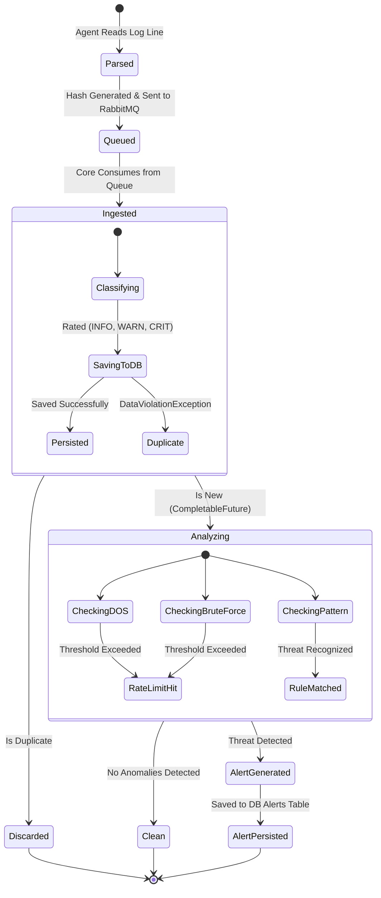

# Sentinel SIEM - State Machine Diagram

Illustrates the lifecycle states that a parsed log event goes through in its journey from the Agent file reader through the backend architecture.

```mermaid
stateDiagram-v2
    [*] --> Parsed : Agent Reads Log Line
    
    Parsed --> Queued : Hash Generated & Sent to RabbitMQ
    
    Queued --> Ingested : Core Consumes from Queue
    
    state Ingested {
        [*] --> Classifying
        Classifying --> SavingToDB : Rated (INFO, WARN, CRIT)
        SavingToDB --> Persisted : Saved Successfully
        SavingToDB --> Duplicate : DataViolationException
    }
    
    Ingested --> Discarded : Is Duplicate
    Discarded --> [*]
    
    Ingested --> Analyzing : Is New (CompletableFuture)
    
    state Analyzing {
        [*] --> CheckingDOS
        [*] --> CheckingBruteForce
        [*] --> CheckingPattern
        
        CheckingDOS --> RateLimitHit : Threshold Exceeded
        CheckingBruteForce --> RateLimitHit : Threshold Exceeded
        CheckingPattern --> RuleMatched : Threat Recognized
    }
    
    Analyzing --> Clean : No Anomalies Detected
    Clean --> [*]
    
    Analyzing --> AlertGenerated : Threat Detected
    AlertGenerated --> AlertPersisted : Saved to DB Alerts Table
    AlertPersisted --> [*]
```
