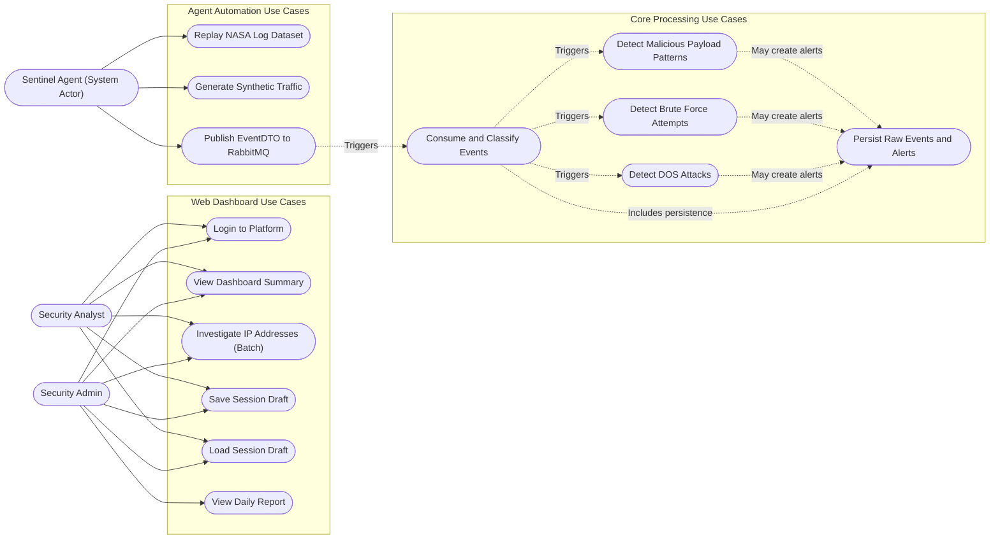

# Sentinel SIEM - Use Case Diagram

Details the implemented capabilities available to users and system actors.

```mermaid
flowchart LR
    %% Actors
    Admin(["Security Admin"])
    Analyst(["Security Analyst"])
    SysAgent(["Sentinel Agent (System Actor)"])
    
    %% Boundaries
    subgraph UI["Web Dashboard Use Cases"]
        UC1(["Login to Platform"])
        UC2(["View Dashboard Summary"])
        UC3(["Investigate IP Addresses (Batch)"])
        UC4(["Save Session Draft"])
        UC5(["Load Session Draft"])
        UC6(["View Daily Report"])
    end
    
    subgraph AGENT["Agent Automation Use Cases"]
        UC7(["Replay NASA Log Dataset"])
        UC8(["Generate Synthetic Traffic"])
        UC9(["Publish EventDTO to RabbitMQ"])
    end

    subgraph CORE["Core Processing Use Cases"]
        UC10(["Consume and Classify Events"])
        UC11(["Detect DOS Attacks"])
        UC12(["Detect Brute Force Attempts"])
        UC13(["Detect Malicious Payload Patterns"])
        UC14(["Persist Raw Events and Alerts"])
    end

    %% Relationships
    Admin --> UC1
    Admin --> UC2
    Admin --> UC3
    Admin --> UC4
    Admin --> UC5
    Admin --> UC6
    
    Analyst --> UC1
    Analyst --> UC2
    Analyst --> UC3
    Analyst --> UC4
    Analyst --> UC5
    
    SysAgent --> UC7
    SysAgent --> UC8
    SysAgent --> UC9
    
    %% Automation and processing triggers
    UC9 -.->|Triggers| UC10
    UC10 -.->|Triggers| UC11
    UC10 -.->|Triggers| UC12
    UC10 -.->|Triggers| UC13
    UC10 -.->|Includes persistence| UC14
    UC11 -.->|May create alerts| UC14
    UC12 -.->|May create alerts| UC14
    UC13 -.->|May create alerts| UC14
```
