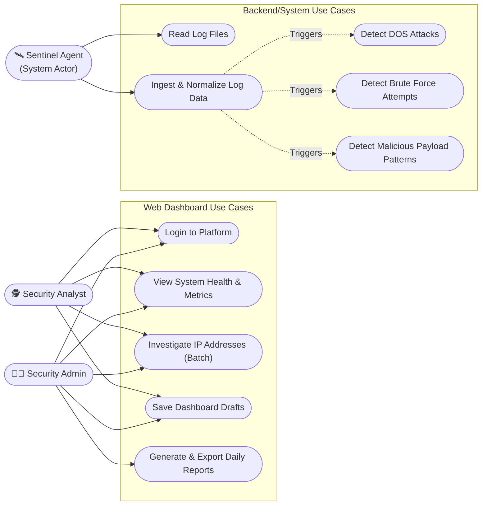

# Sentinel SIEM - Use Case Diagram

Details the capabilities of different system actors within the platform.

```mermaid
flowchart LR
    %% Actors
    Admin(["🧑‍💻 Security Admin"])
    Analyst(["🕵️ Security Analyst"])
    SysAgent(["🛰️ Sentinel Agent<br/>(System Actor)"])
    
    %% Boundaries
    subgraph UI["Web Dashboard Use Cases"]
        UC1(["Login to Platform"])
        UC2(["View System Health & Metrics"])
        UC3(["Investigate IP Addresses (Batch)"])
        UC4(["Save Dashboard Drafts"])
        UC5(["Generate & Export Daily Reports"])
    end
    
    subgraph BE["Backend/System Use Cases"]
        UC6(["Read Log Files"])
        UC7(["Ingest & Normalize Log Data"])
        UC8(["Detect DOS Attacks"])
        UC9(["Detect Brute Force Attempts"])
        UC10(["Detect Malicious Payload Patterns"])
    end

    %% Relationships
    Admin --> UC1
    Admin --> UC2
    Admin --> UC3
    Admin --> UC4
    Admin --> UC5
    
    Analyst --> UC1
    Analyst --> UC2
    Analyst --> UC3
    Analyst --> UC4
    
    SysAgent --> UC6
    SysAgent --> UC7
    
    %% Implicit triggers
    UC7 -.->|Triggers| UC8
    UC7 -.->|Triggers| UC9
    UC7 -.->|Triggers| UC10
```
