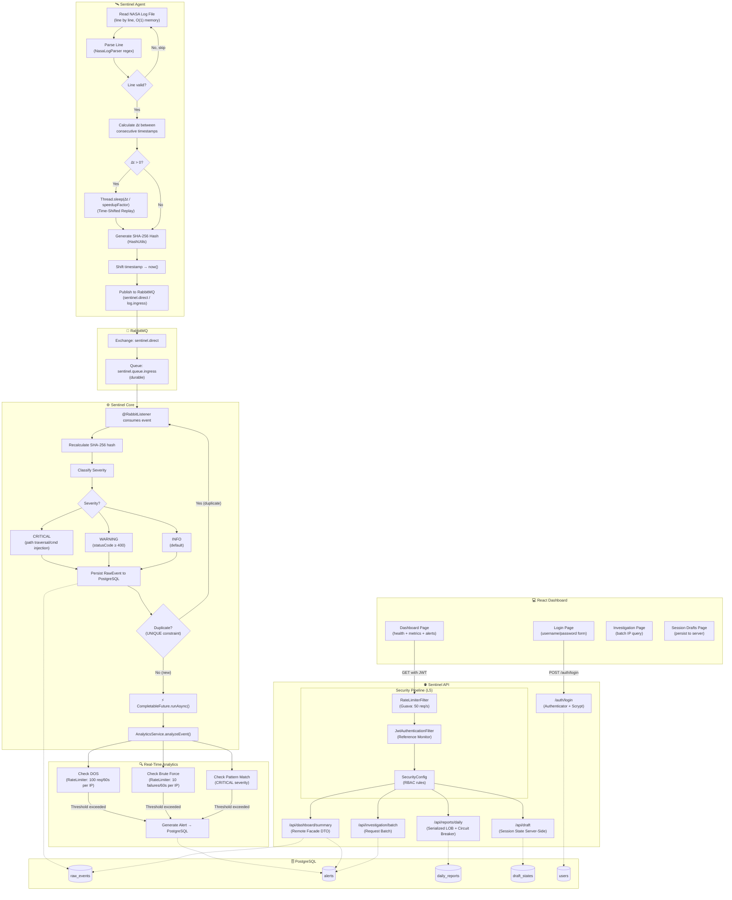
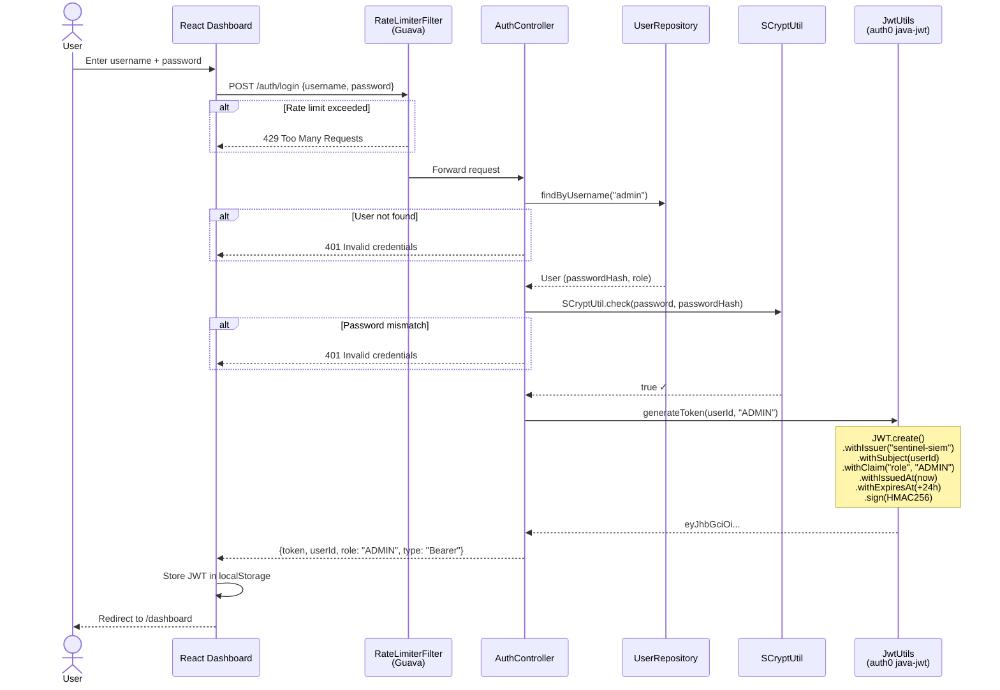
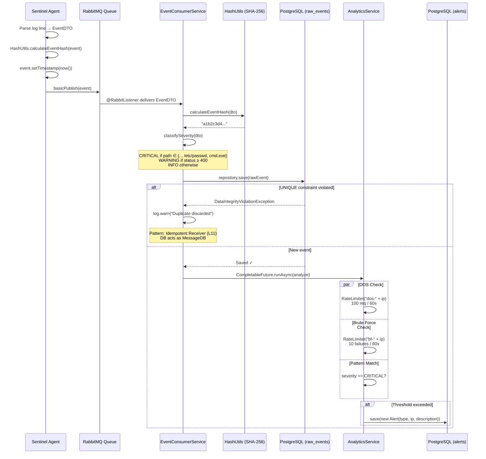

# Sentinel SIEM — System Flow UML

## 1. End-to-End Data Flow (Activity Diagram)

---

## 2. Authentication & Authorization Sequence (Login Flow)

---

## 3. Event Ingestion & Idempotency Sequence

---

## 4. RBAC Access Control Flow

```mermaid
flowchart LR
    subgraph JWT_Claims["JWT Token Claims"]
        ISS["iss: sentinel-siem"]
        SUB["sub: userId"]
        ROLE["role: ADMIN | ANALYST"]
        EXP["exp: +24h"]
    end

    subgraph Filter["JwtAuthenticationFilter<br/>(Reference Monitor)"]
        F1["Extract Bearer token"]
        F2["JWT.require(HMAC256)<br/>.withIssuer(sentinel-siem)<br/>.verify(token)"]
        F3["Extract role claim"]
        F4["Create GrantedAuthority<br/>ROLE_ADMIN or ROLE_ANALYST"]
    end

    subgraph SecurityConfig["SecurityConfig<br/>(RBAC Rules)"]
        R1["/auth/login → permitAll()"]
        R2["/api/reports/** → hasRole ADMIN"]
        R3["/api/** → authenticated()"]
    end

    subgraph Endpoints["Protected Endpoints"]
        E1["Dashboard ✅ ADMIN+ANALYST"]
        E2["Investigation ✅ ADMIN+ANALYST"]
        E3["Drafts ✅ ADMIN+ANALYST"]
        E4["Reports ✅ ADMIN only"]
    end

    JWT_Claims --> Filter --> SecurityConfig --> Endpoints
```

